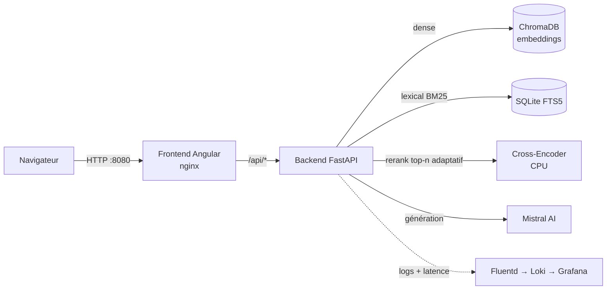

# Portfolio RAG — Chatbot IA

[](https://github.com/MarieSainte/Portfolio_RAG_LLM/actions/workflows/deploy.yml)
[](https://github.com/MarieSainte/Portfolio_RAG_LLM/actions/workflows/pr-checks.yml)

Portfolio interactif d'ingénieur IA doté d'un **chatbot RAG** (Retrieval-Augmented Generation) capable de répondre aux recruteurs à partir d'une base de projets réels — **multilingue** (FR/EN), avec citations et **zéro hallucination**. Retrieval **hybride** (dense + lexical BM25) suivi d'un **reranking cross-encoder**, génération via Mistral AI, orchestration **LangChain**, **observabilité** complète (logs + latence dans Grafana), gate qualité **Ragas**, et une **CI/CD** de bout en bout.

---

## ✨ Fonctionnalités

- **Chatbot RAG multi-tours et multilingue** (FR/EN) ancré sur les données : réponses sourcées avec liens GitHub, mémoire de conversation, **prompt anti-hallucination** strict.
- **Retrieval hybride** : recherche **dense** (ChromaDB) **+ lexicale** (SQLite FTS5/BM25), fusionnées, puis **reranking cross-encoder multilingue** (CPU). Nombre de contextes **adaptatif** selon la question.
- **Observabilité** : logs applicatifs structurés → Fluentd → Loki → **Grafana**, avec suivi de la **latence** des réponses IA.
- **Évaluation automatisée** avec **Ragas** en **gate de CI** (déclenchée uniquement si le pipeline RAG change ; juge `mistral-small` pour maîtriser le coût).
- **Tests** (pytest) + **lint** (ruff) + **rate-limiting** de l'API pour protéger les crédits LLM.
- **Frontend Angular 21** bilingue (i18n FR/EN), thème clair/sombre.
- **Déploiement continu robuste** : gates qualité → images Docker sur GHCR (épinglées par SHA) → déploiement SSH avec healthchecks et **rollback**.

## 🏗️ Architecture



Le frontend nginx sert l'app Angular **et** proxifie `/api` vers le backend : un seul port exposé, pas de souci de CORS.

## 🧩 Stack technique

| Domaine | Technologies |
|---|---|
| **Frontend** | Angular 21, TypeScript, SCSS, RxJS, ngx-translate |
| **Backend** | Python 3.10, FastAPI, Pydantic, Uvicorn |
| **RAG / LLM** | LangChain, Mistral AI, ChromaDB, SQLite FTS5 (BM25), Sentence-Transformers, Cross-Encoder reranker |
| **Observabilité** | Fluentd → Loki → **Grafana** (logs + latence), LangSmith (tracing optionnel) |
| **Évaluation** | Ragas (LLM-as-a-judge) |
| **Infra / CI-CD** | Docker, Docker Compose, GitHub Actions, GHCR |

## 🔎 Pipeline RAG

1. **Indexation** — le CSV (profil + projets) est découpé en **chunks entiers par projet** (`CHUNK_SIZE` large : chaque projet reste d'un bloc, ce qui évite les hallucinations de technos) puis indexé dans **deux** stores : ChromaDB (vecteurs `all-MiniLM-L6-v2`) et un index lexical SQLite FTS5.
2. **Recherche hybride** — en parallèle, recherche **dense** (Chroma, proximité sémantique — robuste au multilingue et aux reformulations) et **lexicale** (FTS5/BM25, correspondance exacte : technos, acronymes). Candidats fusionnés et dédupliqués.
3. **Reranking adaptatif** — un cross-encoder multilingue (`mmarco-mMiniLMv2-L12`, CPU) réordonne l'ensemble et ne garde que les *top-n* — **n s'adapte à la longueur de la question** (courte → peu de contextes précis ; longue → plus de contextes).
4. **Génération** — Mistral AI répond en s'appuyant **uniquement** sur ce contexte (prompt système strict : anti-hallucination, ton chaleureux, multilingue).

## 🗂️ Journal des interactions

Chaque échange (`/chat`) est enregistré dans une base **SQLite persistante** avec un index **FTS5** (recherche plein-texte BM25 sur questions + réponses). Utile pour analyser ce que demandent les visiteurs.

Consultation via un endpoint d'administration, **désactivé par défaut** : il ne s'active que si `ADMIN_TOKEN` est défini, et exige alors l'en-tête `X-Admin-Token`.

```bash
# Dernières interactions
curl -H "X-Admin-Token: $ADMIN_TOKEN" http://localhost:8080/api/admin/interactions
# Recherche plein-texte (FTS5)
curl -H "X-Admin-Token: $ADMIN_TOKEN" "http://localhost:8080/api/admin/interactions?q=fine-tuning"
```

La base vit dans `/app/data` (bind mount `./data` en prod) : elle **survit au redéploiement**. Au déploiement, seul le volume **Chroma** est reconstruit (pour réindexer avec le `CHUNK_SIZE` courant) — le journal et l'historique d'observabilité sont préservés.

## 📈 Observabilité

Les logs applicatifs (JSON structuré) partent sur `stderr` → **Fluentd** → **Loki** → **Grafana**. Un dashboard **Backend — Logs** provisionné affiche :

- le **flux de logs** filtrable par niveau (INFO/WARNING/ERROR) ;
- le **débit de logs** par niveau ;
- la **latence des réponses IA** (`latency_ms` loggé à chaque `/chat`) — courbes p50/p95 + médiane.

En local, Grafana est sur http://localhost:3000 (accès anonyme). En prod, il n'écoute que sur la loopback du serveur (accès par **tunnel SSH**), avec login admin.

## 🚀 Démarrage local

Prérequis : Docker + Docker Compose.

```bash
cp .env.example .env        # renseigner MISTRAL_API_KEY
docker compose up --build
```

- Frontend : http://localhost:8080
- API : http://localhost:8000 · ChromaDB : http://localhost:8001

## 📊 Évaluation (Ragas)

```bash
cd backend
pip install -r requirements-eval.txt
python -m evals.run_ragas
```

Note la chaîne RAG sur un jeu de **15 questions** de référence (FR + EN) : *faithfulness*, *context precision/recall*, *answer relevancy*. Seuils calibrés sur le baseline mesuré (`0.72 / 0.30 / 0.70 / 0.50`) — la CI **échoue** si un score passe en dessous. Pour maîtriser le coût, le juge LLM est `mistral-small` et l'éval ne se déclenche **que si le pipeline RAG change** (prompt, retrieval, corpus). Voir [`backend/evals/`](backend/evals/).

## 🔄 CI/CD (GitHub Actions)

Workflows réutilisables ([`_tests.yml`](.github/workflows/_tests.yml), [`_ragas.yml`](.github/workflows/_ragas.yml)) partagés entre les PR et le déploiement (DRY) :

| Workflow | Déclencheur | Pipeline |
|---|---|---|
| [`pr-checks.yml`](.github/workflows/pr-checks.yml) | Pull Request | tests (pytest) → gate Ragas |
| [`deploy.yml`](.github/workflows/deploy.yml) | push sur `main` | tests → gate Ragas → build+push GHCR → déploiement SSH → healthcheck |

- **Déploiement gaté** : on ne build/déploie que si les tests **et** la qualité RAG passent.
- **Images épinglées par SHA** + healthchecks compose → déploiement traçable et vérifié.
- **Rollback** : `deploy.yml` en `workflow_dispatch` avec l'entrée `rollback_sha` redéploie une image antérieure sans rebuild.

Secrets requis : `MISTRAL_API_KEY`, `SSH_PRIVATE_KEY`, `SERVER_HOST`, `SERVER_USER` (+ optionnels : `ADMIN_TOKEN`, `GRAFANA_ADMIN_PASSWORD`, `LANGSMITH_API_KEY`).

## 📁 Structure

```
.
├── backend/            # API FastAPI + pipeline RAG LangChain
│   ├── app/            # config, controllers, services (rag, mistral, lexical), data (corpus CSV)
│   └── evals/          # évaluation Ragas + dataset + analyse retrieval dense/lexical
├── frontend/           # application Angular 21
├── logging/            # stack observabilité (Fluentd, Loki, dashboards Grafana)
├── docker-compose.yml       # dev (build local)
├── docker-compose.prod.yml  # prod (images GHCR)
└── .github/workflows/       # CI/CD
```
