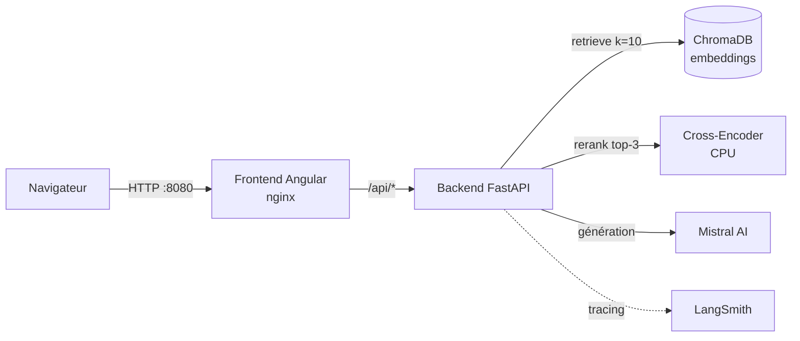

# Portfolio RAG — Chatbot IA

[](https://github.com/MarieSainte/Portfolio_RAG_LLM/actions/workflows/deploy.yml)
[](https://github.com/MarieSainte/Portfolio_RAG_LLM/actions/workflows/rag-eval.yml)

Portfolio interactif d'ingénieur IA doté d'un **chatbot RAG** (Retrieval-Augmented Generation) capable de répondre aux recruteurs à partir d'une base de projets réels — avec citations et **zéro hallucination**. Pipeline de retrieval à deux étages (recherche dense + reranking cross-encoder), génération via Mistral AI, orchestration **LangChain**, et une **CI/CD** complète (build → gate qualité **Ragas** → déploiement).

---

## ✨ Fonctionnalités

- **Chatbot RAG** ancré sur les données : recherche sémantique dans les projets, réponses sourcées avec liens GitHub.
- **Retrieval à deux étages** : recherche dense (ChromaDB) élargie, puis **reranking cross-encoder multilingue** sur CPU pour la précision.
- **Orchestration LangChain** (LCEL) entièrement traçable via **LangSmith**.
- **Évaluation automatisée** avec **Ragas** (faithfulness, context precision/recall, answer relevancy) en **gate bloquante** de CI.
- **Rate-limiting** de l'API pour protéger les crédits LLM.
- **Frontend Angular 21** bilingue (i18n FR/EN), thème clair/sombre.
- **Déploiement continu** : images Docker publiées sur GHCR, déployées par SSH.

## 🏗️ Architecture



Le frontend nginx sert l'app Angular **et** proxifie `/api` vers le backend : un seul port exposé, pas de souci de CORS.

## 🧩 Stack technique

| Domaine | Technologies |
|---|---|
| **Frontend** | Angular 21, TypeScript, SCSS, RxJS, ngx-translate |
| **Backend** | Python 3.10, FastAPI, Pydantic, Uvicorn |
| **RAG / LLM** | LangChain, Mistral AI, ChromaDB, Sentence-Transformers, Cross-Encoder reranker |
| **Observabilité** | LangSmith (tracing) |
| **Évaluation** | Ragas (LLM-as-a-judge) |
| **Infra / CI-CD** | Docker, Docker Compose, GitHub Actions, GHCR |

## 🔎 Pipeline RAG

1. **Indexation** — le CSV des projets est découpé (`RecursiveCharacterTextSplitter`) et vectorisé (`all-MiniLM-L6-v2`) dans ChromaDB au démarrage.
2. **Recherche dense** — les *k=10* chunks les plus proches de la question sont récupérés.
3. **Reranking** — un cross-encoder multilingue (`mmarco-mMiniLMv2-L12`) réordonne et ne garde que les *top-3* (précision accrue, tourne sur CPU).
4. **Génération** — Mistral AI répond en s'appuyant **uniquement** sur ce contexte (prompt système strict anti-hallucination).

## 🚀 Démarrage local

Prérequis : Docker + Docker Compose.

```bash
cp .env.example .env        # renseigner MISTRAL_API_KEY
docker compose up --build
```

- Frontend : http://localhost:8080
- API : http://localhost:8000 · ChromaDB : http://localhost:8001

## 📊 Évaluation (Ragas)

```bash
cd backend
pip install -r requirements-eval.txt
python -m evals.run_ragas
```

Note la chaîne RAG sur un jeu de questions de référence. La CI **échoue** si un score moyen passe sous son seuil (faithfulness ≥ 0.70, autres ≥ 0.60) — voir [`backend/evals/`](backend/evals/).

## 🔄 CI/CD (GitHub Actions)

| Workflow | Déclencheur | Rôle |
|---|---|---|
| [`rag-eval.yml`](.github/workflows/rag-eval.yml) | push / PR sur `backend/` | Gate qualité RAG (Ragas) |
| [`deploy.yml`](.github/workflows/deploy.yml) | push sur `main` | Build + push images GHCR → déploiement SSH |

Secrets requis : `MISTRAL_API_KEY`, `SSH_PRIVATE_KEY`, `SERVER_HOST`, `SERVER_USER` (+ `LANGSMITH_API_KEY` optionnel).

## 📁 Structure

```
.
├── backend/            # API FastAPI + pipeline RAG LangChain
│   ├── app/            # config, controllers, services (rag, mistral), schemas
│   └── evals/          # évaluation Ragas + dataset
├── frontend/           # application Angular 21
├── docker-compose.yml       # dev (build local)
├── docker-compose.prod.yml  # prod (images GHCR)
└── .github/workflows/       # CI/CD
```
